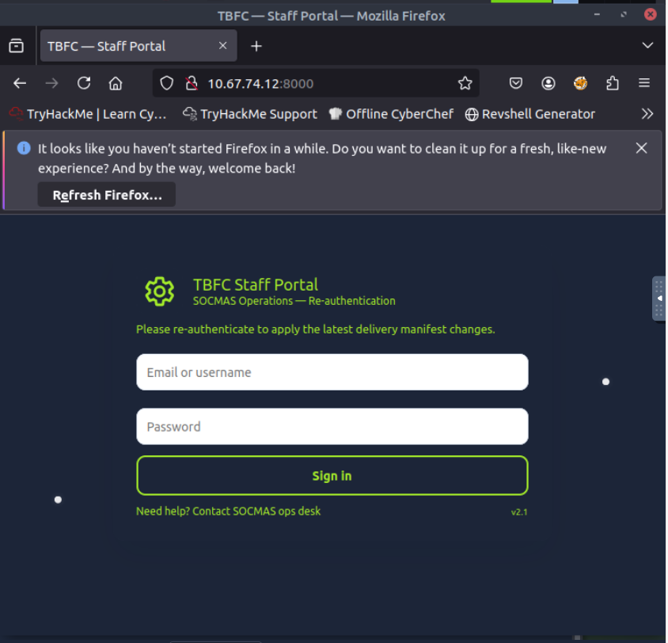
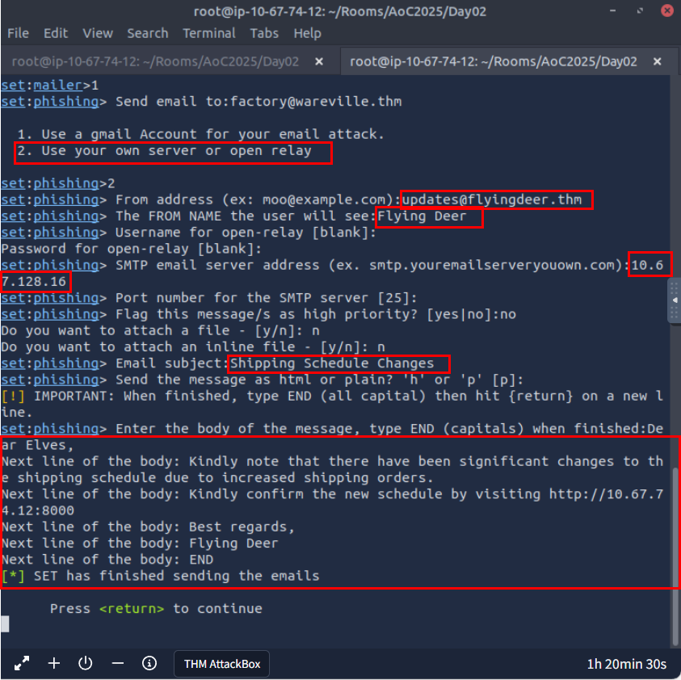
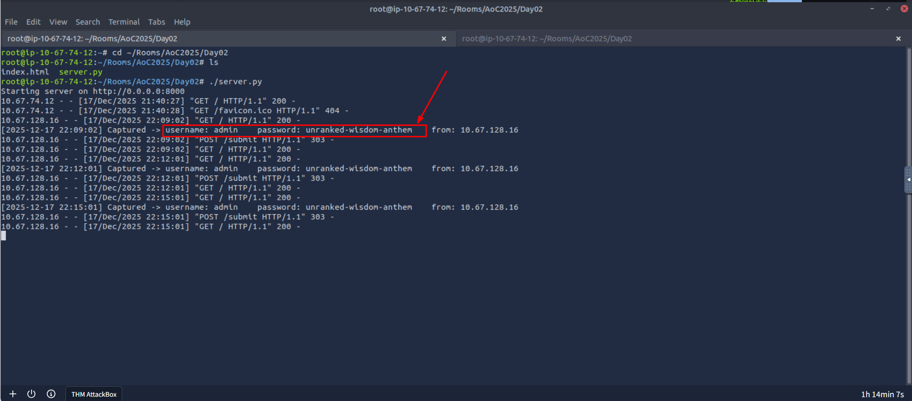
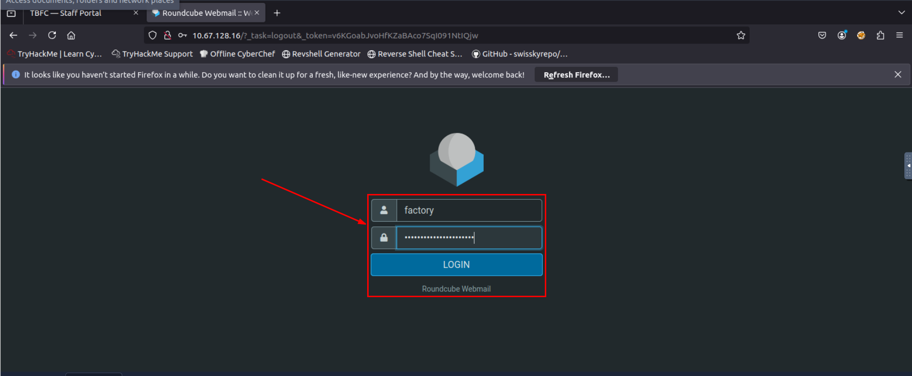

# Security Assessment: TBFC Phishing Simulation

* **Role:** Red Team Operator
* **Date:** December 2025
* **Tools:** Social-Engineer Toolkit (SET), Python, Roundcube Webmail
* **Target:** The Best Festival Company (TBFC)

## 1. Executive Summary
**Objective**
The goal of this engagement was to assess the security awareness of TBFC employees regarding phishing attacks. The Red Team executed a targeted spear-phishing campaign to determine if employees would click malicious links and submit valid credentials to an unauthorized portal.

**Key Findings**
The assessment successfully demonstrated that TBFC employees are susceptible to social engineering. By impersonating a trusted vendor ("Flying Deer"), I was able to direct a target user to a fraudulent login page and harvest valid credentials for the `admin` and `factory` accounts.

**Impact**
Successful exploitation resulted in the compromise of the `factory` user account. This access allowed for the viewing of sensitive internal logistics data (shipping schedules and inventory), posing a significant risk to the company's operations.

---

## 2. Methodology & Attack Lifecycle

The assessment followed a standard Social Engineering attack lifecycle: **Research -> Hook -> Play -> Exit.**

### Attack Overview
The following mind map illustrates the concepts and flow utilized during this engagement, highlighting the relationship between Social Engineering principles and the technical execution via SET.

### Phase 1: Infrastructure Setup (The Trap)
I deployed a lightweight Python web server to host a cloned version of the TBFC login portal. This server was configured to log any POST requests (credentials) directly to the console.

**Listener Configuration:**
I initiated the server on the attack host (`10.67.74.12`) on port 8000.

**The Phishing Page:**
The landing page was designed to mimic the legitimate TBFC Staff Portal to build trust with the victim.

### Phase 2: Delivery via SET (The Lure)
I utilized the **Social-Engineer Toolkit (SET)** to orchestrate the email delivery. The attack vector selected was a **Mass Mailer Attack**.

**Selection:**

**Configuration Details:**
I configured the email to appear as if it came from "Flying Deer," a known shipping partner, citing a "Shipping Schedule Change" to create urgency.
* **Target:** `factory@wareville.thm`
* **Spoofed Sender:** `updates@flyingdeer.thm`
* **SMTP Relay:** `10.67.128.16`
* **Payload URL:** `http://10.67.74.12:8000`

### Phase 3: Exploitation (The Catch)
Once the email was sent, I monitored the Python web server. Within minutes, the target user clicked the link and attempted to log in. The script successfully intercepted the credentials in cleartext.

**Captured Data:**
The listener captured the password `unranked-wisdom-anthem` for the user `admin`.

### Phase 4: Post-Exploitation Verification
To verify the impact of the compromised credentials, I utilized the captured password to attempt a login as the `factory` user on the legitimate internal portal.

**Login Attempt:**

**Successful Access:**
The credentials were valid, granting full access to the "Factory" mailbox. I was able to retrieve sensitive internal communications regarding a production request for 1,984,000 units.

---

## 3. Mitigation & Recommendations

To defend against similar attacks in the future, I recommend TBFC implement the following "Defense in Depth" strategies:

### Technical Controls
1.  **Email Authentication:** Implement **SPF, DKIM, and DMARC** records to prevent external attackers from successfully spoofing the `flyingdeer.thm` domain or internal domains.
2.  **External Email Banner:** Configure the email gateway to append an `[EXTERNAL]` tag to the subject line of any email originating outside the organization.
3.  **FIDO2 / WebAuthn:** Implement hardware-based Multi-Factor Authentication (MFA). This prevents credential harvesting because the physical token will not authenticate with a fake domain.

### Human Controls
1.  **S.T.O.P. Training:** Reinforce the S.T.O.P. mnemonic (Suspicious, Telling, Offering, Pushing) during security awareness training.
2.  **Reporting Button:** Add a simple "Report Phishing" button to the email client to allow users to quickly flag suspicious emails for SOC review.
